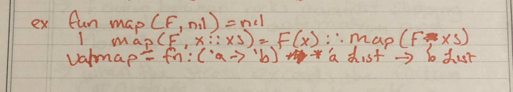
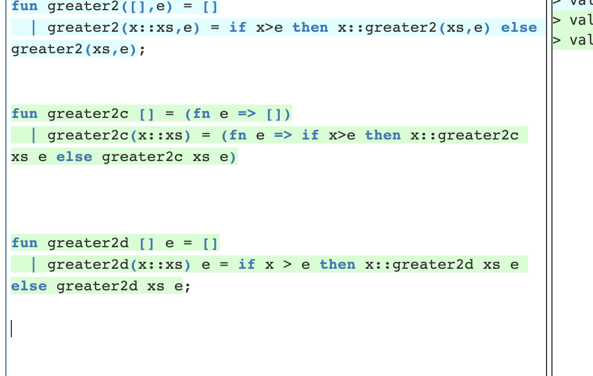

# Week5- tutorial Reflection by Jimmy Zhang 
## Polymorphism
**polymorphic** function need aleast two types
overloading: is the ability to create multiple functions of the same name with different implementations
- example 1: int x = 1+2
- example 2: string s = "st" * "ri" * "ng"
Parameter coercion: an impliict type conversion on parameter
- make writing code easier 
- example: void f(double x) that double can be appiled to many sub type like int, float, short, char, and byte.

**key note ML does not perform Type coercion** 
Parametric Polymorphism
-  function that contain the one or more of the same type variable like a venn diagram
-  fun f(a,b) = a+b;
-  val f = fn :'a *'a ->int

Subtype Polymorphism
- function that contain the one or more of its consitructed types have a subtypes like a class use in c++ and java
-  example would be something like class 
## Final Look at Ml
higher order programming Functions as parameters or return functions as return values.
**Anonymous function**- function simply that pass it in as an argument to another function.

**Note:** most use fn

fn x = x+1
For building small functions on the fly.

Since ML have many built in function that are concern with function application to object and structures.
in ML these built-in functions are curried 
**what is curried?**
- Currying is a way to break down function that take in multiple arguments into a link chain of function that also take one argument each. 
- fun f x y = exp;
- **curried function have a different way to call it.**
- Example 1: fun add(x)=( fn (y) => (fn (z) => x+y+z ;
- val add +fn: int -> int -> int -> int
- this is error : add(x,y,z);
- correct way : add x y z;
- Example 2 fun do (f,x) can not be called like a tuple but like this fun do f x 

**Map**
-The map function takes a function F and a list [a1,a2,...,an], and produces the list [F(a1), F(a2),..., F(an)].
That is, it applies F to each element of the list and returns the list of resulting values.

**Example: ** 

**Fold Function**
ML provides the user a pair of functions called foldr and foldl. Both functions perform a variety of fold operation, which takes a list L =[a1,a2,...,an] and treats each element an as if it were a function; call this function Fai. 
When we apply a folding operation to L, we construct the function that is the composition of all the functions Fa1,Fa2,...,Fan.
The difference between foldr and foldl is that foldr start from the right most, and foldl composes them starting from the left most.

example foldr[1,2,3,4] -> [1,2,3,4]
example foldl[1,2,3,4] -> [4,3,2,1]

partical evaluation 
- create new function from the curry library.
- for example
- val theList = foldl(fn x = x+5)
- val int list -> int list
- thelist[1,2,3]
- val it = [8,7,6]:int list

**Recursion and Curried Function**

# Practice 
- https://www.cs.nmsu.edu/~rth/cs/cs471/sml.html

## Reference
- Webber, Adam. Modern Programming Languages: A Practical Introduction. Franklin, Beedle &amp; Associates, 2011.
- https://brightspace.uri.edu/content/enforced/188472-2226_200753_3000_0000_SS3/CSC301_slides/Week%206%20LV2%20-%20A%20Final%20Look%20at%20ML.pdf?_&d2lSessionVal=dIGhiPJ4EpidZJxPUL279OQ1K&ou=188472
- https://brightspace.uri.edu/content/enforced/188472-2226_200753_3000_0000_SS3/CSC301_slides/Week%206%20LV1_%20Polymorphism.pdf?_&d2lSessionVal=dIGhiPJ4EpidZJxPUL279OQ1K&ou=188472
- “Argument Coercion in C/C++.” GeeksforGeeks, 26 Dec. 2018, https://www.geeksforgeeks.org/argument-coercion-in-c-c/. 
- Functions in SML - Kansas State University. https://people.cs.ksu.edu/~xou/505f10/slides/SMLfunctions.pdf. 
